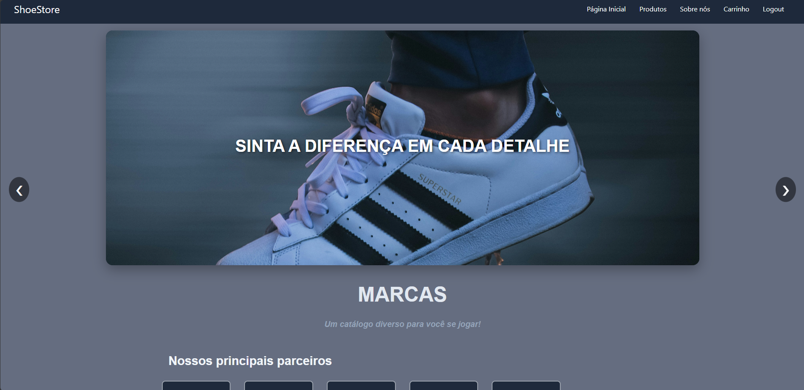

# ShoeStore



> Este projeto é um e-commerce focado na venda de tênis, sapatos e calçados em geral, desenvolvido como parte do Projeto Integrador (PI) da faculdade.

Neste repositório, você encontrará um guia passo a passo para rodar o projeto em sua máquina local.

## 📦 Como rodar o projeto localmente

Para instalar o ShoeStore e utilizá-lo, siga estas etapas:

## Passo 1: Clonar o repositório

Comece clonando este repositório para sua máquina local. Abra o terminal e execute o seguinte comando:

```bash
git clone https://github.com/seu-usuario/nome-do-repositorio.git
```

Isso criará uma cópia local do repositório em seu ambiente.

## Passo 2: Instalar dependências

Navegue até o diretório raiz do projeto:

```bash
cd nome-do-repositorio
```
Em seguida execute o seguinte comando para instalar as dependências do Node.js:

```bash
npm install
```
Execute o projeto:
```bash
npm start
```
> Acesse em http://localhost:4200 ou conforme configurado.


### Tecnologias Utilizadas

[![Angular][Angular.io]][Angular-url]
[![TypeScript][TypeScript-badge]][TypeScript-url]
[![JSON][JSON-badge]][JSON-url]
[![HTML5][HTML5-badge]][HTML5-url]
[![CSS3][CSS3-badge]][CSS3-url]
[![json-server][JsonServer-badge]][JsonServer-url]
[![localStorage][LocalStorage-badge]][LocalStorage-url]

## 🤝 Colaboradores

Agradecemos às seguintes pessoas que contribuíram para este projeto:

## 🤝 Colaboradores

<table align="center">
  <tr>
    <td align="center">
      <a href="#" title="Gustavo Patriota Silva">
        <br />
        <sub><b>Gustavo Patriota Silva</b></sub>
      </a>
    </td>
    <td align="center">
      <a href="#" title="Lucas Freitas Bezerra">
        <br />
        <sub><b>Lucas Freitas Bezerra</b></sub>
      </a>
    </td>
    <td align="center">
      <a href="#" title="Gabriel Lins Rosa">
        <br />
        <sub><b>Gabriel Lins Rosa</b></sub>
      </a>
    </td>
    <td align="center">
      <a href="#" title="Ronaldo Mota da Silva Junior">
        <br />
        <sub><b>Ronaldo Mota da Silva Junior</b></sub>
      </a>
    </td>
  </tr>
  <tr>
    <td align="center">
      <a href="#" title="Weliclene Inacio Pedroza">
        <br />
        <sub><b>Weliclene Inacio Pedroza</b></sub>
      </a>
    </td>
    <td align="center">
      <a href="#" title="João Victor de Oliveira Godoy Lima">
        <br />
        <sub><b>João Victor de Oliveira Godoy Lima</b></sub>
      </a>
    </td>
    <td align="center">
      <a href="#" title="Maria Eduarda">
        <br />
        <sub><b>Maria Eduarda Maklouf</b></sub>
      </a>
    </td>
    <td align="center">
      <a href="#" title="Vinicius de Paula Silva">
        <br />
        <sub><b>Vinicius de Paula Silva</b></sub>
      </a>
    </td>
  </tr>
</table>


<!-- LINKS & IMAGENS -->
[Angular.io]: https://img.shields.io/badge/Angular-DD0031?style=for-the-badge&logo=angular&logoColor=white
[Angular-url]: https://angular.io/
[HTML5-badge]: https://img.shields.io/badge/HTML5-E34F26?style=for-the-badge&logo=html5&logoColor=white
[HTML5-url]: https://developer.mozilla.org/en-US/docs/Web/HTML
[CSS3-badge]: https://img.shields.io/badge/CSS3-1572B6?style=for-the-badge&logo=css3&logoColor=white
[CSS3-url]: https://developer.mozilla.org/en-US/docs/Web/CSS
[TypeScript-badge]: https://img.shields.io/badge/TypeScript-3178C6?style=for-the-badge&logo=typescript&logoColor=white
[TypeScript-url]: https://www.typescriptlang.org/
[JSON-badge]: https://img.shields.io/badge/JSON-FFD500?style=for-the-badge&logo=json&logoColor=black
[JSON-url]: https://www.json.org/json-en.html
[LocalStorage-badge]: https://img.shields.io/badge/localStorage-yellow?style=for-the-badge
[LocalStorage-url]: https://developer.mozilla.org/pt-BR/docs/Web/API/Window/localStorage
[JsonServer-badge]: https://img.shields.io/badge/json--server-333?style=for-the-badge&logo=json&logoColor=white
[JsonServer-url]: https://github.com/typicode/json-server